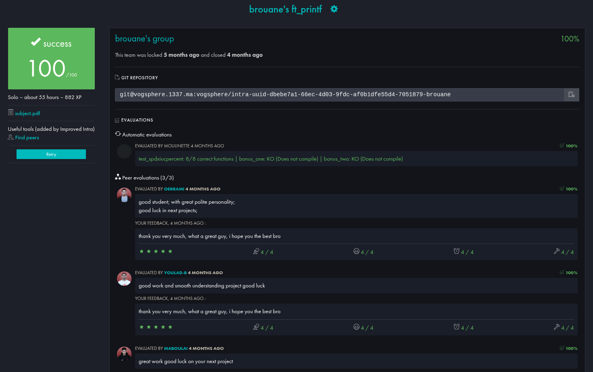

<div align="center">

```
███████╗████████╗    ██████╗ ██████╗ ██╗███╗   ██╗████████╗███████╗
██╔════╝╚══██╔══╝    ██╔══██╗██╔══██╗██║████╗  ██║╚══██╔══╝██╔════╝
█████╗     ██║       ██████╔╝██████╔╝██║██╔██╗ ██║   ██║   █████╗  
██╔══╝     ██║       ██╔═══╝ ██╔══██╗██║██║╚██╗██║   ██║   ██╔══╝  
██║        ██║       ██║     ██║  ██║██║██║ ╚████║   ██║   ██║     
╚═╝        ╚═╝       ╚═╝     ╚═╝  ╚═╝╚═╝╚═╝  ╚═══╝   ╚═╝   ╚═╝     
```

*A 42 curriculum project — reimplement printf using variadic functions.*


</div>

---

## ✅ Project grade screenshot



## 📖 What is ft_printf?

**ft_printf** is a 42 curriculum project where you reimplement the C standard `printf` function from scratch using **variadic arguments** (`va_list`, `va_start`, `va_arg`, `va_end`).

The rules are strict:
- You cannot use the real `printf`
- You must handle a defined set of **format specifiers**
- The function must return the **total number of characters printed**
- The result is compiled into a static library: `libftprintf.a`

This project teaches you how format strings work internally, how to build recursive numeric printers, and how to handle the full variety of C types through a single variadic interface.

---

## 🚀 Getting Started

### Compilation

```bash
make          # build libftprintf.a
make clean    # remove object files
make fclean   # full cleanup
make re       # recompile from scratch
```

### Linking to Your Project

```bash
gcc main.c -L. -lftprintf -o my_program
```

```c
#include "ft_printf.h"
```

### Usage

```c
ft_printf("Hello, %s! You are %d years old.\n", "brouane", 21);
ft_printf("Pointer: %p\n", ptr);
ft_printf("Hex: %x / %X\n", 255, 255);
ft_printf("100%%\n");
```

---

## ⚙️ Supported Format Specifiers

| Specifier | Type | Output |
|-----------|------|--------|
| `%c` | `int` (char) | Single character |
| `%s` | `char *` | String (`(null)` if NULL) |
| `%d` | `int` | Signed decimal integer |
| `%i` | `int` | Signed decimal integer |
| `%u` | `unsigned int` | Unsigned decimal integer |
| `%x` | `unsigned int` | Hexadecimal — lowercase (`ff`) |
| `%X` | `unsigned int` | Hexadecimal — uppercase (`FF`) |
| `%p` | `void *` | Pointer address (`0x...` or `(nil)`) |
| `%%` | — | Literal percent sign |

---

## 📁 Project Structure

```
ft_printf/
│
├── Makefile                  # Build rules for libftprintf.a
├── ft_printf.h               # All function prototypes
│
├── ft_printf.c               # Entry point — parses format string
├── format_checker.c          # Dispatcher — routes specifier to correct printer
│
├── char_printer.c            # Handles %c
├── string_printer.c          # Handles %s (with NULL guard)
├── number_printer.c          # Handles %d and %i (signed, recursive)
├── unsigned_printer.c        # Handles %u (unsigned, recursive)
├── lower_hexa_printer.c      # Handles %x (lowercase hex, recursive)
├── upper_hexa_printer.c      # Handles %X (uppercase hex, recursive)
├── long_hexa_printer.c       # Handles pointer address hex (%p internals)
└── address_printer.c         # Handles %p (prepends "0x" or prints "(nil)")
```

---

## 🔄 Program Flow

```
ft_printf(format, ...)
  │
  ├── va_start()                     initialize variadic argument list
  │
  └── loop over format string
        │
        ├── regular char    ──► char_printer()         write it directly
        │
        └── '%' found       ──► format_checker(next_char, va_list)
                                  │
                                  ├── 'c'  ──► char_printer(va_arg)
                                  ├── 's'  ──► string_printer(va_arg)
                                  ├── 'd'  ──► number_printer(va_arg)
                                  ├── 'i'  ──► number_printer(va_arg)
                                  ├── 'u'  ──► unsigned_printer(va_arg)
                                  ├── 'x'  ──► lower_hexa_printer(va_arg)
                                  ├── 'X'  ──► upper_hexa_printer(va_arg)
                                  ├── 'p'  ──► address_printer(va_arg)
                                  └── '%'  ──► char_printer('%')
  │
  └── va_end()                       clean up variadic list
        │
        └── return total printed chars
```

---

## 🧠 Key Implementation Details

### Recursive Numeric Printing

All numeric printers use **recursion** to print digits in the correct order without needing a buffer:

```
number_printer(1337)
  └─► number_printer(133)
        └─► number_printer(13)
              └─► number_printer(1)
                    └─► char_printer('1')   → prints '1'
              └─► char_printer('3')         → prints '3'
        └─► char_printer('3')               → prints '3'
  └─► char_printer('7')                     → prints '7'
Result: "1337"
```

The same pattern applies to `unsigned_printer`, `lower_hexa_printer`, `upper_hexa_printer`, and `long_hexa_printer` — each using its own base string.

---

### Hexadecimal Bases

```c
// lowercase:  "0123456789abcdef"
lower_hexa_printer(255)  →  "ff"

// uppercase:  "0123456789ABCDEF"
upper_hexa_printer(255)  →  "FF"

// pointer (unsigned long, lowercase):
long_hexa_printer(addr)  →  used internally by address_printer
```

---

### Pointer Printing

```
address_printer(NULL)   →  "(nil)"

address_printer(ptr)    →  "0x" + long_hexa_printer((unsigned long)ptr)
                        →  e.g. "0x7ffd3a2c1b40"
```

The pointer value is cast to `unsigned long` before printing to safely handle 64-bit addresses.

---

### NULL String Guard

```c
string_printer(NULL)  →  "(null)"
string_printer("hi") →  "hi"
```

---

### Return Value

Every printer returns the **number of bytes written**. These are accumulated up the call chain so `ft_printf` returns the precise total — matching the real `printf` behavior.

```
ft_printf("hi %s\n", "42")
  char_printer('h')         → 1
  char_printer('i')         → 1
  char_printer(' ')         → 1
  string_printer("42")      → 2
  char_printer('\n')        → 1
                              ─
  return                      6
```

---

## 🛠️ Error Handling

| Case | Behavior |
|------|----------|
| `NULL` format string | Returns `-1` |
| Trailing `%` with no specifier | Returns `-1` |
| `NULL` pointer (`%p`) | Prints `(nil)` |
| `NULL` string (`%s`) | Prints `(null)` |

---

## 📊 Specifier Coverage

| Category | Specifiers |
|----------|------------|
| Characters | `%c`, `%s` |
| Signed integers | `%d`, `%i` |
| Unsigned integers | `%u` |
| Hexadecimal | `%x`, `%X` |
| Pointer | `%p` |
| Escape | `%%` |

> **Note:** Width, precision, and flag modifiers (`-`, `0`, `*`, `.`) are **not** implemented — this is the mandatory part only.

---

## 🔗 Resources

| Resource | Link |
|----------|------|
| 42 Cursus Guide | [ft_printf chapter](https://42-cursus.gitbook.io/guide/2-rank-01/ft_printf) |
| Variadic functions in C | [cppreference — va_list](https://en.cppreference.com/w/c/variadic) |
| printf format specifiers | [cppreference — printf](https://en.cppreference.com/w/c/io/fprintf) |
| ft_printf tester | [Tripouille/printfTester](https://github.com/Tripouille/printfTester) |

---

## 📝 Notes on AI Usage

AI tools were used during development for:
- Debugging recursive printer edge cases
- Understanding variadic argument promotion rules
- Improving documentation clarity

All algorithm design, logic implementation, and decisions were fully understood and owned by the author.

---

<div align="center">

*Made with recursion and undefined behavior as part of the 42 curriculum.*

</div>
